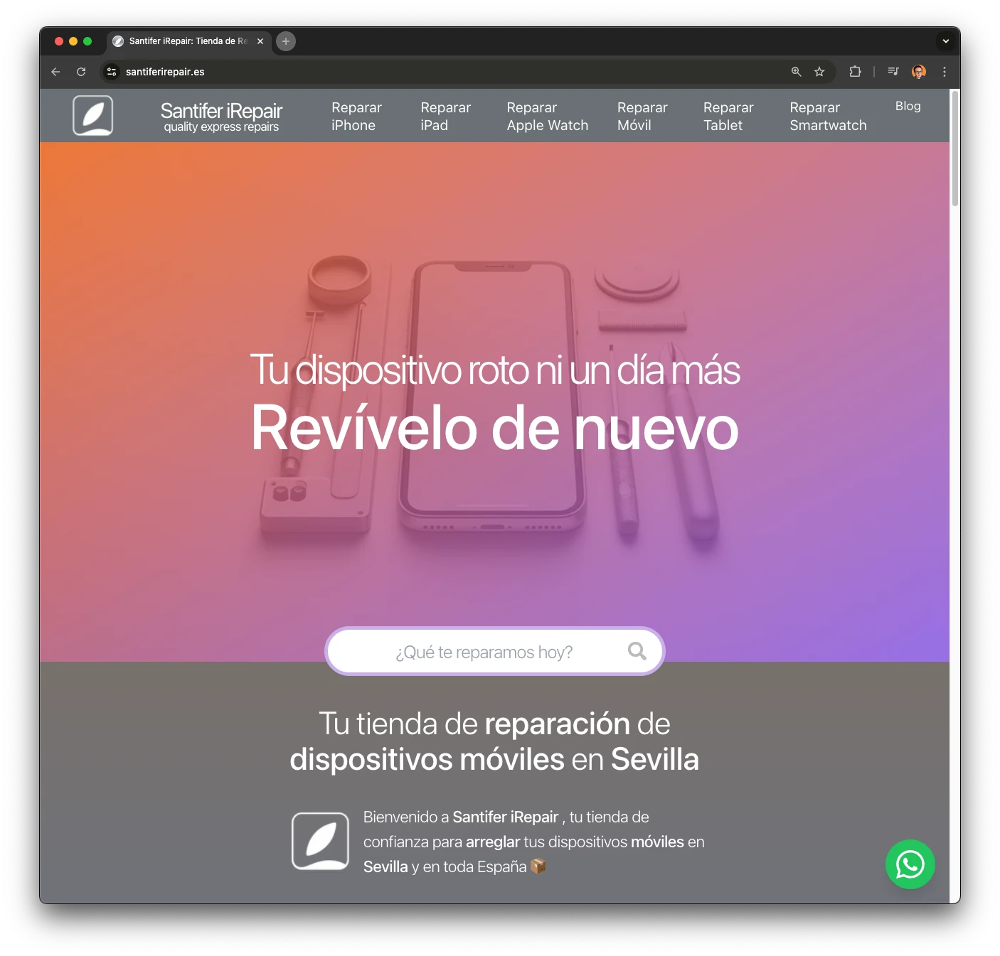
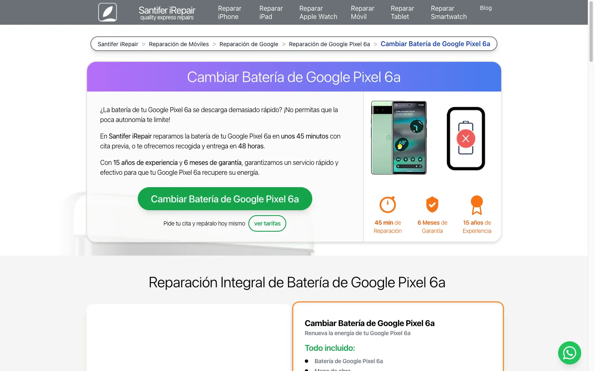
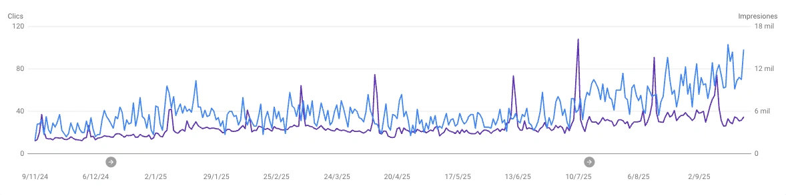

# Santifer iRepair — Programmatic SEO Website

**[:gb: English](#the-problem)** | **[:es: Español](#es-versión-en-español)**

> Astro-based programmatic SEO website that generated 15,500+ unique pages from an Airtable ERP, reaching 2,000 monthly clicks in Google Spain.

[](https://santifer.io/programmatic-seo)
[](https://santiferirepair.es)

---



---

## The Problem

Local repair shops have thousands of potential service pages (every brand x model x repair type), but creating them manually is impossible. Existing solutions either generate thin, duplicate content or require expensive CMS platforms.

## The Solution

A fully automated pipeline that reads device data from an Airtable ERP, generates optimized images with Sharp, injects EXIF metadata for Google Images, and builds 15,500+ unique Astro pages with proper structured data, breadcrumbs, and internal linking.

**Key Features:**
- 9 Node.js scripts that generate images, sitemaps, and metadata from Airtable
- Parametric Astro routes: one layout generates thousands of unique pages
- EXIF injection for Google Images ranking (geo-coordinates, descriptions)
- JSON-LD structured data (LocalBusiness, BreadcrumbList, Organization)
- Client-side device search across 300+ models and 50+ brands

---

## Tech Stack


---

## How It Works

```
Airtable (ERP)  →  Node.js Scripts  →  Astro SSG  →  Vercel/Cloudflare
   300+ models       image pipeline      15,500+         CDN + Edge
   50+ brands        EXIF injection       pages
   reviews           sitemaps
```

Every device model, brand, and repair type stored in Airtable flows through a pipeline of Node.js scripts that generate optimized images with SEO metadata, then Astro builds parametric pages using dynamic routes like:

- `/reparar-movil/samsung/galaxy-s24/` — model page
- `/reparar-movil/samsung/sevilla` — brand + city
- `/reparar-movil/cambiar-pantalla/sevilla` — repair type + city
- `/reparar-apple-watch/apple/se-40mm/` — Apple product families



---

## Installation

```bash
# 1. Install dependencies
npm install

# 2. Configure environment
cp .env.example .env
# Add your Airtable API key and base ID
```

---

## Usage

```bash
# Run image pipeline (requires Airtable data)
node scripts/generarImagenesReparacionesModelos.mjs
node scripts/ExifLocal.mjs
node scripts/sitemaps.mjs

# Start dev server
npm run dev

# Build for production
npm run build
```

---

## Configuration

| Variable | Description | Required |
|----------|-------------|----------|
| `AIRTABLE_API_KEY` | Airtable personal access token | Yes |
| `AIRTABLE_BASE_ID` | Airtable base containing device data | Yes |

---

## The Pipeline Scripts

The core of the pSEO approach — 9 Node.js scripts that transform Airtable data into optimized web assets:

| Script | What it does |
|--------|-------------|
| `generarImagenesReparacionesModelos.mjs` | Generates device-specific images with model overlays |
| `generarImagenesReparacionesMarcas.mjs` | Creates brand-level repair guide images and thumbnails |
| `generarImagenesReparacionesTipos.cjs` | Converts device type templates to optimized WebP |
| `generarImagenesBackgroundPasosReparacion.mjs` | Generates repair step illustrations with branding |
| `generarImagenesReseñas.mjs` | Creates review/testimonial profile images |
| `CasosExito.mjs` | Downloads and optimizes before/after case study images |
| `ExifLocal.mjs` | Injects EXIF metadata (description, GPS) for Google Images SEO |
| `scriptImagenesGoogle.mjs` | Fetches and processes external device images |
| `sitemaps.mjs` | Generates XML sitemaps organized by device type and category |

The ~15,000 generated images are not included in this repo — they are pipeline output, not source code.

---

## Project Structure

```
├── src/
│   ├── pages/                    # Astro dynamic routes (parametric SEO pages)
│   │   ├── reparar-[paramTipo]/  # /reparar-movil, /reparar-tablet, /reparar-smartwatch
│   │   ├── [paramMarcaApple]/    # Apple-specific product family routes
│   │   ├── cambiar-[paramRep]/   # Repair type pages
│   │   └── blog/                 # Blog with markdown content
│   ├── layouts/                  # Page templates per hierarchy level
│   │   ├── TipoLayout.astro      #   Device type (mobile/tablet/watch)
│   │   ├── MarcaLayout.astro     #   Brand (Samsung, Apple, Xiaomi...)
│   │   ├── ModeloLayout.astro    #   Specific model
│   │   └── ReparacionLayout.astro#   Repair type (screen, battery...)
│   ├── components/               # 60+ Astro components
│   │   ├── metadatos/            #   JSON-LD structured data
│   │   ├── FAQs.astro            #   Auto-generated FAQ sections
│   │   └── Buscador.astro        #   Client-side device search
│   ├── lib/                      # Airtable client + data caching
│   └── content/blog/             # 16 markdown blog posts
├── scripts/                      # Image generation pipeline
│   ├── plantillas/               # Base templates for image compositing
│   └── src/                      # Script-specific type definitions
├── public/
│   ├── marcas/                   # Brand logos (50+)
│   ├── scripts/                  # Client-side JS (search, modals, reviews)
│   └── fonts/                    # Graphik typeface
└── vercel.json                   # 700+ redirect rules + headers
```

---

## Results



| Metric | Value |
|--------|-------|
| Pages generated | 15,500+ |
| Google-indexed keywords | 1,800+ |
| Monthly organic clicks (peak) | 2,000 |
| Google Search Console growth | 0 → 2K clicks in 12 months |
| Business outcome | Successful exit (Sep 2025) |

---

## License

This project is shared as a portfolio piece and educational reference. The code structure and automation patterns are freely available for learning. Brand assets and business-specific content remain property of their respective owners.

---

---

# :es: Version en Español

> Web de SEO programatico construida con Astro que genero 15.500+ paginas unicas desde un ERP en Airtable, alcanzando 2.000 clics mensuales y posicionando 1.800+ keywords en Google España.

[](https://santifer.io/seo-programatico)

---

## El Problema

Las tiendas de reparacion locales tienen miles de paginas de servicio potenciales (cada marca x modelo x tipo de reparacion), pero crearlas manualmente es imposible. Las soluciones existentes generan contenido duplicado o requieren plataformas CMS caras.

## La Solucion

Un pipeline completamente automatizado que lee datos de dispositivos desde un ERP en Airtable, genera imagenes optimizadas con Sharp, inyecta metadatos EXIF para Google Images, y construye 15.500+ paginas unicas con Astro, incluyendo structured data, breadcrumbs y enlazado interno.

**Funcionalidades:**
- 9 scripts Node.js que generan imagenes, sitemaps y metadatos desde Airtable
- Rutas parametricas en Astro: un layout genera miles de paginas unicas
- Inyeccion EXIF para posicionar en Google Images (coordenadas, descripciones)
- JSON-LD structured data (LocalBusiness, BreadcrumbList, Organization)
- Buscador de dispositivos del lado cliente con 300+ modelos y 50+ marcas

---

## Stack Tecnico


---

## Los Scripts del Pipeline

| Script | Que hace |
|--------|----------|
| `generarImagenesReparacionesModelos.mjs` | Genera imagenes por modelo de dispositivo con overlays |
| `generarImagenesReparacionesMarcas.mjs` | Crea imagenes de guia de reparacion por marca |
| `generarImagenesReparacionesTipos.cjs` | Convierte plantillas por tipo de dispositivo a WebP |
| `generarImagenesBackgroundPasosReparacion.mjs` | Genera ilustraciones de pasos de reparacion |
| `generarImagenesReseñas.mjs` | Crea imagenes de perfil para reseñas desde Airtable |
| `CasosExito.mjs` | Descarga y optimiza imagenes antes/despues |
| `ExifLocal.mjs` | Inyecta metadatos EXIF para SEO en Google Images |
| `scriptImagenesGoogle.mjs` | Obtiene y procesa imagenes externas de dispositivos |
| `sitemaps.mjs` | Genera sitemaps XML por tipo de dispositivo y categoria |

---

## Instalacion

```bash
# 1. Instalar dependencias
npm install

# 2. Configurar entorno
cp .env.example .env
# Añade tu API key de Airtable y base ID
```

---

## Uso

```bash
# Ejecutar pipeline de imagenes (requiere datos en Airtable)
node scripts/generarImagenesReparacionesModelos.mjs
node scripts/ExifLocal.mjs
node scripts/sitemaps.mjs

# Servidor de desarrollo
npm run dev

# Build de produccion
npm run build
```

---

## Resultados

| Metrica | Valor |
|---------|-------|
| Paginas generadas | 15.500+ |
| Keywords indexadas en Google | 1.800+ |
| Clics organicos mensuales (pico) | 2.000 |
| Crecimiento en GSC | 0 → 2K clics en 12 meses |
| Resultado de negocio | Venta exitosa (sep 2025) |

---

## Licencia

Este proyecto se comparte como pieza de portfolio y referencia educativa. La estructura del codigo y los patrones de automatizacion estan disponibles para aprendizaje. Los activos de marca y contenido especifico del negocio pertenecen a sus respectivos propietarios.

---

## Let's Connect

[](https://santifer.io)
[](https://linkedin.com/in/santifer)
[](mailto:hola@santifer.io)
